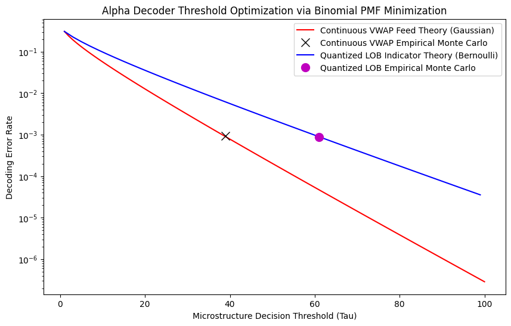

# market-microstructure-alpha-decoder.
Quantifying information loss and parity between continuous VWAP feeds and quantized LOB indicators.

# High-Frequency Market Microstructure: Alpha Decoder Parity Simulation

A quantitative analysis investigating the information loss and statistical parity between continuous, high-fidelity feeds (e.g., VWAP) and ultra-low-latency, quantized Limit Order Book (LOB) indicator streams.

## 🛠️ Project Status & Roadmap
The core statistical engine, Monte Carlo simulations, and threshold optimization models are **100% complete and validated**. This repository is currently being updated with structured documentation for recruitment presentation.

- [x] Mathematical framework & analytical error bounds
- [x] Vectorized Monte Carlo verification engines
- [x] Threshold ($\tau$) optimization engine for the Parity Paradox
- [ ] Write detailed Markdown documentation explaining the financial intuition of the results
- [ ] Add formal mathematical write-up for the Binomial/Gaussian decoding proofs
